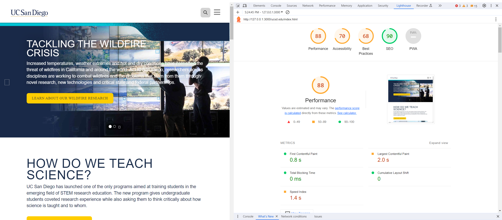

# CSE210-WarmUpTask2

## Branches
It's recommended that every person edits on his/her own branch, then push to the main branch. Ensure that the main branch is without any bugs.

Each time edition: 

first fetch and pull from the main branch to your own branch, then edit on your own branch, then push to your own branch, then merge to the main branch. Write some comments or write notes in this file to make others understand.

## Netlify
For this repo's main branch, you can check the Netlify at https://capable-bienenstitch-3a6abf.netlify.app/ucsd.edu/.

## Updates
2023/10/24 - repo initialization

2023/10/27 - jieyi - replace the remote css link to the local css link(index.html line) otherwise our modification on the resources will not perform, fix the problem of "accessbility - Heading elements are not in a sequentially-descending order"

### Change Log - 2023/10/29
**Authors**: Fangqi Yuan, Jason, Dev Churiwala

#### Improvements:

- **Images**:
  - Changed all image formats to `.webp`.
  - Compressed all images. 
    - Benefits: `.webp` is more performant than `.jpg`, reducing the payload delivered.

- **CSS**:
  - Minified all blocking CSS files for faster load times.

- **Fonts**:
  - Cleaned up `bris-sans` font file that was blocking rendering.
  - Removed `font_awesome` which was also blocking rendering.

- **Script and Link Tags**:
  - Added `defer` and `preload` attributes to improve loading.
  - Replaced `document.write()` with `<script>` tags for better performance.
  - Added `preconnect` for external links to establish network connections early and increase performance.

- **Deleted Items**:
  - Removed unnecessary and non-performant scripts from the HTML.

